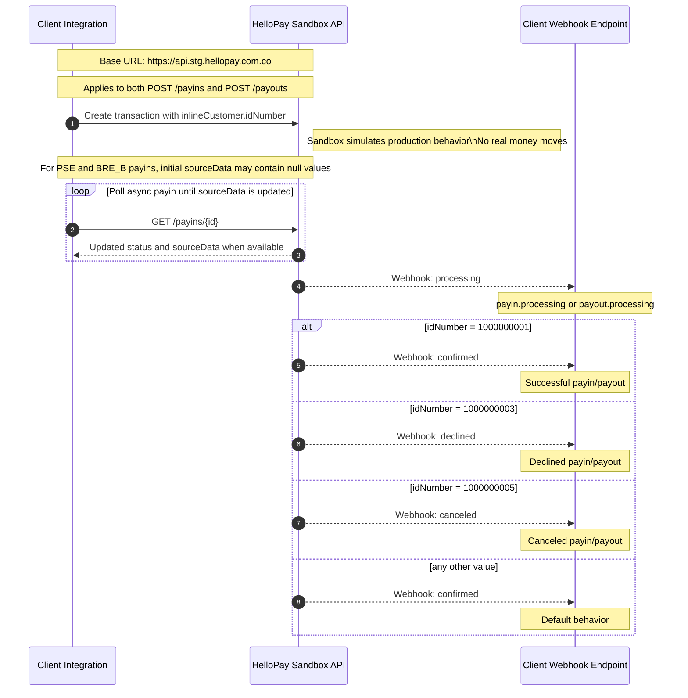

## Overview

The sandbox environment is the place where you can validate your integration before going live.

Base URL:

```text
https://api.stg.hellopay.com.co
```

This environment lets you test the main API endpoints for both payins and payouts using the same request structure as production.

No real money moves in sandbox. HelloPay does not connect directly to real payment methods such as PSE or BRE-B in this environment. Instead, it simulates the expected production behavior so you can validate your integration end-to-end.

## Test Document Numbers

For both payins and payouts, the final transaction outcome is determined by the value sent in `inlineCustomer.idNumber`.

| What you want to test | Document number |
|-----------------------|-----------------|
| Successful payin/payout | `1000000001` |
| Declined payin/payout | `1000000003` |
| Canceled payin/payout | `1000000005` |
| Default (also confirmed) | Any other value |

## Timing

After creating a payin or payout, the transaction status changes in two steps:

1. Almost immediately, HelloPay sends a webhook with status `PROCESSING`.
2. Shortly after (~5 seconds), the final status changes according to the value sent in `inlineCustomer.idNumber`.

This behavior applies to both payins and payouts.

## Polling behavior

For async payin rails such as `PSE` and `BRE_B`, the creation response can omit some source data until HelloPay finishes preparing the flow.

- In `PSE` payins, `sourceData.pseUrl` is returned as `null` right after creation.
- In `BRE_B` payins, `sourceData` depends on `breb.keyType`. `SINGLE_USE` returns the generated key, and `QR_CODE` also returns `sourceData.qrString` with the QR image payload.
- Poll the transaction after creation to retrieve the updated `sourceData` values once HelloPay finishes populating them.
- In sandbox, this update follows the same simulated async behavior as production, so you should handle it with polling or webhooks.

## Webhook Events Sequence

The same sequence applies to both payins and payouts:

1. `payin.processing` / `payout.processing` is sent almost immediately after the transaction is created.
2. `payin.confirmed`, `payin.declined`, or `payin.canceled` is sent next for payins.
3. `payout.confirmed`, `payout.declined`, or `payout.canceled` is sent next for payouts.

## Sandbox Flow Diagram


